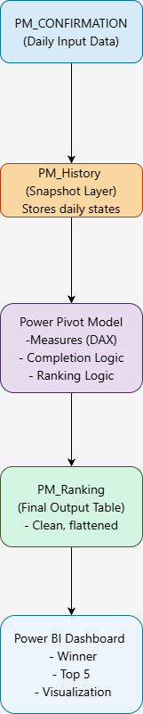
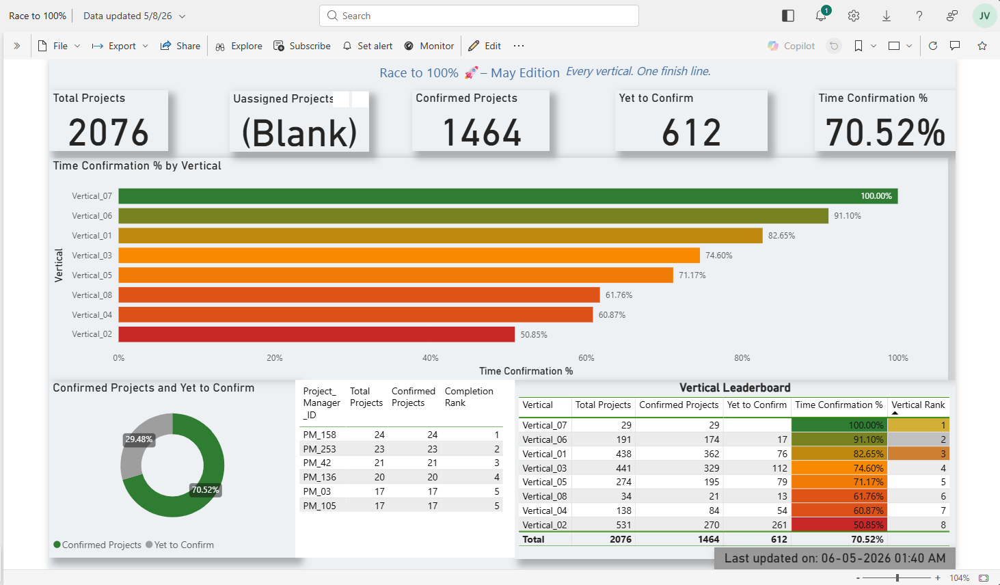

# 🚀 Race to 100% – Analytics Engine & Dashboard

## 📌 Overview
This project demonstrates a **competition tracking snapshot driven analytics system**  to track Project Manager, Vertical perfomance and identify the fastest to reach 100% completion.
It combines **Excel (Power Pivot)** and **Power BI** to deliver a multi-layer dashboard with both competition ranking and operational insights.

The objective is to identify:
- 🏆 First Project Manager to reach 100% completion
- 📊 Top performers based on workload and timing

---

## 🧠 Core Logic

The ranking follows a **multi-level deterministic model**:

1. **Completion Timestamp (Primary)**
   - Earlier completion → better rank

2. **Total Projects (Secondary)**
   - Higher workload → higher priority within same timestamp

3. **Dense Ranking**
   - No rank gaps

---

## 🏗 Architecture

## 📷 Dashboard Preview

## 🧠 Logic Documentation

- 📊 [Data Logic](src/data_model.md)
- 🏆 [Ranking Logic](src/ranking_logic.md)

## 📂 Dataset Overview

The project uses two datasets:

### PM_Ranking
- Final output table used for reporting
- Contains ranking, completion time, and project counts

### PM_Confirmation
- Provides operational metrics like:
  - Confirmation %
  - Vertical performance
  - Workload distribution

## ⚠️ Disclaimer

This project uses **synthetic/demo data**.

- No real production data is included
- Business logic is abstracted
- Intended only for demonstration purposes

