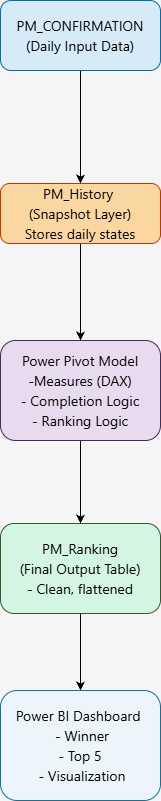
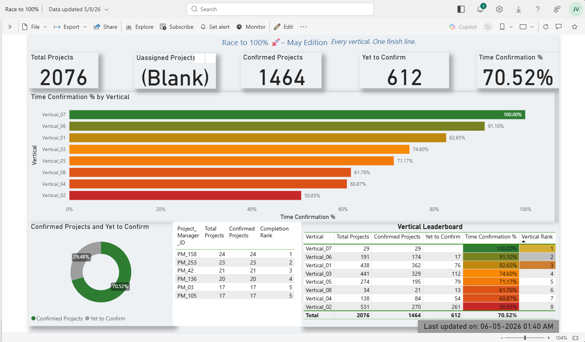
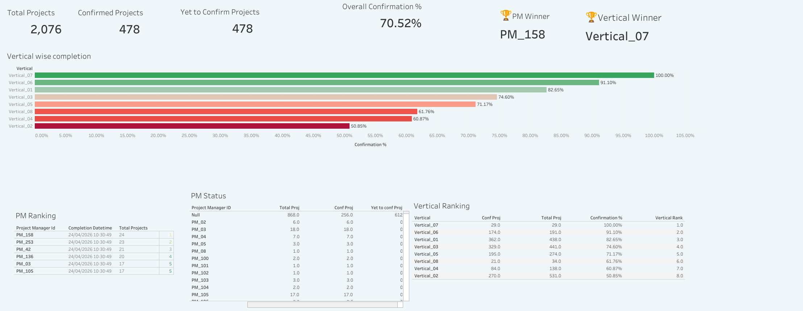

# 🚀 Race to 100% – Analytics Engine & Dashboard

---
## 💡 Motivation / Background

In the existing workflow, timesheet submissions and approvals were managed by Project Managers (PMs) across multiple business verticals. While the process functioned operationally, there was no structured system to track completion performance over time.

At the end of each reporting cycle, it was observed that:
- Some verticals achieved 100% completion of submissions and approvals  
- Several others consistently fell short of complete closure  
- There was no mechanism to drive accountability or encourage timely completion  

This highlighted gaps in:
- Visibility into progress across PMs and verticals  
- Performance accountability  
- Motivation for timely execution  

To address this, a **“Race to 100%” performance initiative** was introduced.

The concept aimed to:
- Reward the **first 5 Project Managers** who achieved 100% completion  
- Recognize the **top 3 verticals** based on full approval rates  
- Introduce a **competitive and engaging performance environment**  

To support this initiative, a need emerged for a **live, interactive tracking system** that could:
- Monitor daily progress of PMs  
- Provide real-time visibility into completion status  
- Enable fair and transparent performance comparison  
- Drive engagement through competition  

This led to the development of a **snapshot-driven analytics dashboard**, built using daily PM completion data, to track progress dynamically and support data-driven performance management.

👉 The goal was to transform a static process into a competitive, data-driven performance tracking system.

## 📌 Overview

This project demonstrates a **snapshot-driven analytics system** designed to track Project Manager and Vertical performance, and identify the fastest to reach 100% completion.

It combines **Excel (Power Pivot), Power BI, and Tableau** to deliver a multi-layer analytics solution with both competition ranking and operational insights.

### 🎯 Objectives:
- 🏆 Identify the first Project Manager to reach 100% completion  
- 📊 Rank top performers based on completion time and workload  
- 📈 Analyze performance across verticals  

---

## 🧠 Core Logic

The ranking follows a **multi-level deterministic model**:

1. **Completion Timestamp (Primary)**
   - Earlier completion → better rank  

2. **Total Projects (Secondary)**
   - Higher workload → higher priority within the same timestamp  

3. **Dense Ranking**
   - Continuous ranking with no gaps  

---

## 🏗 Architecture

---

## 📊 Dashboards

### 🔹 Power BI Dashboard

---

### 🔹 Tableau Dashboard

🔗 **View Live Dashboard:**  
https://public.tableau.com/views/Raceto100-TableuDashboard/Dashboard1

This version recreates the same analytical solution in Tableau, including:

- KPI tracking (Total, Confirmed, Pending, Completion %)  
- PM ranking and winner identification  
- Vertical-level performance analysis  
- Interactive drill-down using filtering  

---

## 🧠 Logic Documentation

- 📊 [Data Logic](src/data_logic.md)
- 🏆 [Ranking Logic](src/ranking_logic.md)

---

## 📂 Dataset Overview

The project uses two datasets:

### 🔹 PM_Ranking
- Final output table used for reporting  
- Contains ranking, completion timestamp, and project counts  

### 🔹 PM_Confirmation
- Provides operational metrics such as:
  - Confirmation status  
  - Vertical classification  
  - Project-level details  

---

## ⚙️ Tech Stack

- **Excel (Power Pivot, DAX)**
- **Power BI**
- **Tableau**
- **Data Modeling & Aggregation Logic**

---

## 💡 Key Learnings

- Implemented snapshot-based tracking for time-aware analytics  
- Built ranking logic combining temporal and workload factors  
- Resolved aggregation issues and ensured correct percentage calculations  
- Recreated the same analytical model across Power BI and Tableau  

---

## ⚠️ Disclaimer

This project uses **synthetic/demo data**.

- No real production data is included  
- Business logic is abstracted  
- Intended for learning and demonstration purposes only  

---
